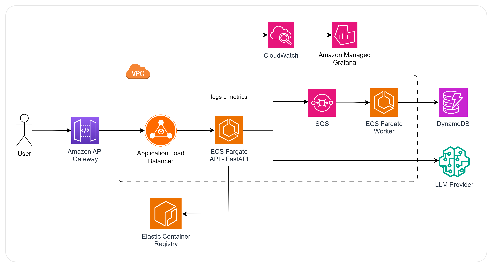

# RT GenAI Platform

Plataforma de backend para integração com modelos LLM e persistência de histórico de interações com usuários.

---

## Funcionalidades

- Geração de texto com modelos LLM (ex: Gemini)
- Persistência de histórico de chats
- Filtro de histórico por parâmetro
- API REST estruturada com FastAPI
- Observabilidade com logging e tempo de resposta do LLM

---

## Tecnologias Utilizadas

- Python 3.10+
- FastAPI
- Uvicorn
- Motor (MongoDB async driver)
- Pydantic
- Logging com logging
- MongoDB
- Docker
- Docker Compose

---

## Como executar o projeto

### Opção recomendada: via Docker

Essa opção sobe a aplicação e o banco de dados MongoDB em containers.

1. **Configure as variáveis de ambiente**  
    Crie um arquivo `.env` na raiz com os seguintes dados:

    ```env
    GEMINI_API_KEY=sua_chave_aqui
    ```

2. **Execute os containers**  
    ```bash
    docker-compose up --build -d
    ```

3. **Acesse a API**  
  Documentação Swagger: http://localhost:8000/docs

---

### Opção alternativa: executar localmente com ambiente virtual

Requer que o MongoDB esteja rodando localmente em sua máquina (porta 27017).

1. **Crie e ative um ambiente virtual**
    ```bash
    python -m venv venv
    venv\Scripts\activate  # Windows
    # ou
    source venv/bin/activate  # Linux/Mac
    ```

2. **Instale as dependências**
    ```bash
    pip install -r requirements.txt
    ```

3. **Configure o arquivo `.env`**
    ```env
    MONGO_URI=mongodb://localhost:27017
    MONGO_DB=chat_db
    GEMINI_API_KEY=sua_chave_aqui
    ```

4. **Execute a aplicação**
    ```bash
    uvicorn main:app --reload
    ```

---

## Endpoints disponíveis

- `POST /v1/chat` — Envia um prompt ao modelo e obtém resposta
- `GET /v1/history/{userId}` — Lista o histórico de interações de um usuário (com filtros opcionais)

---

## Estrutura do Projeto

O projeto segue uma arquitetura em camadas inspirada na Clean Architecture e Hexagonal Architecture:

- **`app/`**  
  Camada de aplicação. Contém os controllers (endpoints), services (coordenação de regras) e DTOs.

- **`domain/`**  
  Núcleo da regra de negócio. Define entidades, use cases, interfaces e exceções de domínio, sem dependências externas.

- **`infra/`**  
  Implementa os contratos definidos no domínio, como repositórios, clientes externos (LLM), logging e configurações.

- **`dependency_injection.py`**  
  Gerencia a injeção de dependências entre as camadas.

> As camadas superiores dependem apenas das camadas mais internas por meio de interfaces (ex: app → domain), promovendo desacoplamento e testabilidade. A camada infra implementa os contratos definidos no domínio

---

## Arquitetura Cloud-Native (AWS) 



A solução é baseada em uma arquitetura containerizada e escalável, utilizando AWS ECS Fargate para orquestração dos serviços, com imagens armazenadas no Amazon ECR e comunicação isolada dentro de uma VPC privada. A aplicação backend, construída com FastAPI, expõe endpoints REST através do Amazon API Gateway, garantindo segurança, escalabilidade e gerenciamento centralizado das requisições.

O histórico das interações com os LLMs é persistido de forma assíncrona utilizando uma arquitetura orientada a eventos com Amazon SQS, garantindo desacoplamento, tolerância a falhas e escalabilidade do processo de persistência.

Logs, métricas e falhas são monitorados em tempo real por meio de AWS CloudWatch e Grafana, garantindo observabilidade da plataforma. O banco de dados utilizado é o DynamoDB, adequado ao modelo de dados dinâmico das interações com modelos generativos.

### 1️⃣ Proposta de Escalonamento

- **ECS com Fargate**: provisionamento automático sem gerenciamento de servidores.
- **Auto Scaling** com base em CPU, memória ou métricas de tráfego coletadas pelo **Application Load Balancer**.
- **Alta disponibilidade** via múltiplas zonas de disponibilidade (AZs).
- Banco de dados escalável horizontalmente com **DynamoDB**.

### 2️⃣ Proposta de Observabilidade 

- Logs enviados para o **AWS CloudWatch Logs** via integração nativa.
- **Grafana** utilizado como painel unificado para visualizar métricas do CloudWatch.
- Tempo de resposta do LLM logado e armazenado nos logs para rastreamento de performance.
- Alertas configuráveis via **CloudWatch Alarms** e **Grafana Alerts**.
- (Opcional) Integração com **ELK Stack** para análise detalhada de logs.

### 3️⃣ Justificativa da Escolha do Banco de Dados 

Escolhido: **DynamoDB**.
Justificativas:
  - Banco de dados NoSQL serverless com modelo de cobrança por demanda (pay-per-request)
  - Armazenamento em chave-valor/documento, ideal para registros de interações com diferentes formatos.
  - Alta performance de leitura e escrita com baixa latência e escalabilidade automática.
  - Suporte a filtros eficientes com uso de chaves de partição e índices secundários (ex: por userId, timestamp, model).
  - Integração nativa com outros serviços AWS como SQS, IAM e CloudWatch.
  - Alta disponibilidade e resiliência por padrão, sem necessidade de gerenciar instâncias ou clusters.

### 4️⃣ Resiliência a Falhas 

- Utilização de **filas SQS** para desacoplar e garantir persistência assíncrona do histórico, mesmo em caso de falha temporária do banco de dados;
- **Timeout** e **circuit breaker** nas chamadas ao LLM para evitar travamentos;
- Estratégia de **retry automática** para consumo da fila;
- Deploy distribuído em múltiplas **zonas de disponibilidade (AZs)** com **balanceamento de carga (ALB)**;
- Monitoramento e alertas configurados via **CloudWatch** para detecção precoce de falhas;
- **Fallback** para outro **provedor de LLM** (ex: OpenAI via OpenRouter) em caso de falha no Gemini, via abstração por interface;

---

## Licença

[MIT License](https://github.com/lucmoraees/rt-genai-plataform/blob/main/LICENSE)
